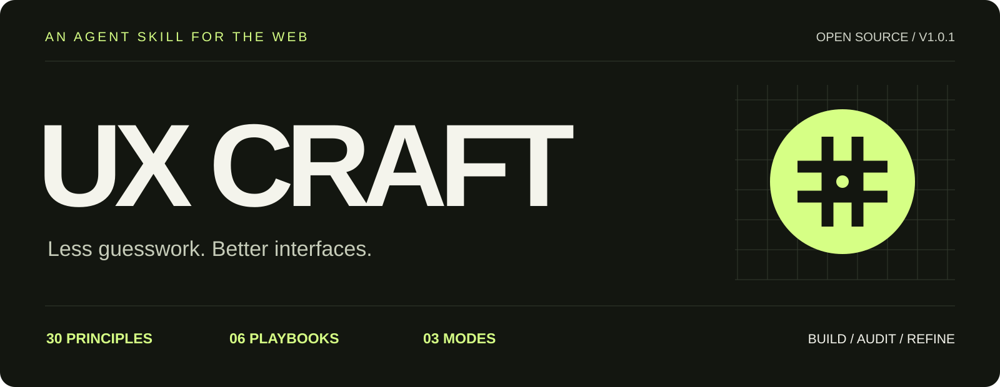

<p align="center"></p>

# UX Craft

**Construí con intención. Auditá con evidencia. Mejorá sin adivinar.**

UX Craft es una skill portable para agentes que convierte principios de UX en decisiones concretas para webs: **problema observado → principio relevante → implementación → trade-off → verificación**.

La documentación principal del repositorio está en [inglés](README.md). La skill responde en el idioma del usuario.

## Incluye

- 30 principios con guías Apply / Avoid / Verify.
- 6 playbooks: servicios, SaaS, ecommerce, dashboards, formularios y contenido.
- 3 modos: Build, Audit y Refine.
- Criterios de accesibilidad, interacción, responsive, errores y recuperación.
- Disciplina de evidencia: sin métricas, research, clientes o resultados inventados.
- Instalador offline para Codex, Claude Code y Cursor.

## Instalación

```bash
python scripts/install.py --agent codex --project /ruta/al/proyecto
python scripts/install.py --agent claude --project /ruta/al/proyecto
python scripts/install.py --agent cursor --project /ruta/al/proyecto
```

También podés copiar manualmente la carpeta `skills/ux-craft` completa al directorio de skills del agente.

## Uso

```text
Usá UX Craft en modo Refine. Revisá primero el proyecto y conservá stack,
marca e integraciones. Mejorá la claridad de la propuesta, el recorrido mobile
y los estados de error/recuperación. Relacioná cada cambio importante con un
problema observado y verificá el recorrido principal. No publiques.
```

[Prompts en español](examples/prompts.es.md) · [Skill](skills/ux-craft/SKILL.md) · [Fuentes](skills/ux-craft/references/sources.md)

## Créditos

Creado por **Paolo · `pnll1991`**. Inspirado por [Laws of UX](https://lawsofux.com/es/), creado por **Jon Yablonski**. Proyecto independiente y no afiliado.

El material original de UX Craft usa licencia MIT. Los textos, posters, marcas y materiales de terceros siguen perteneciendo a sus respectivos propietarios.
